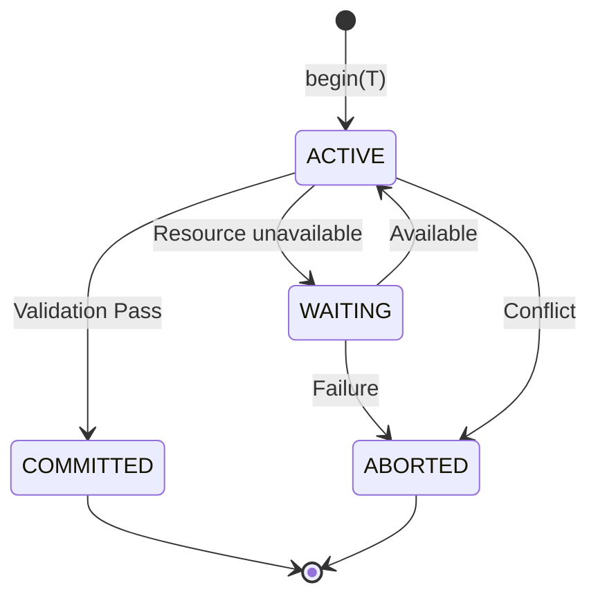
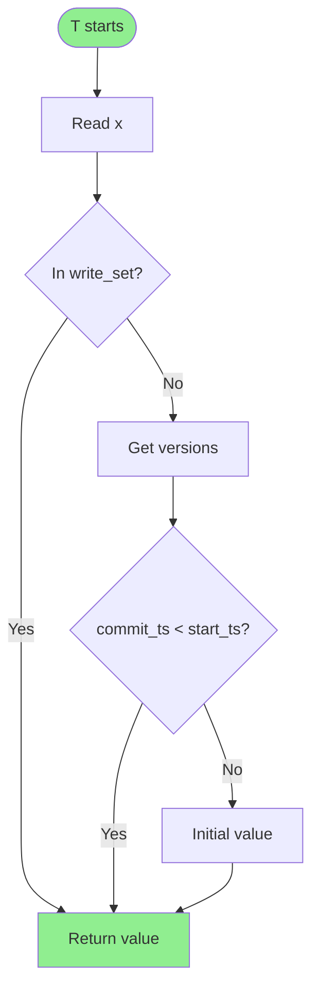
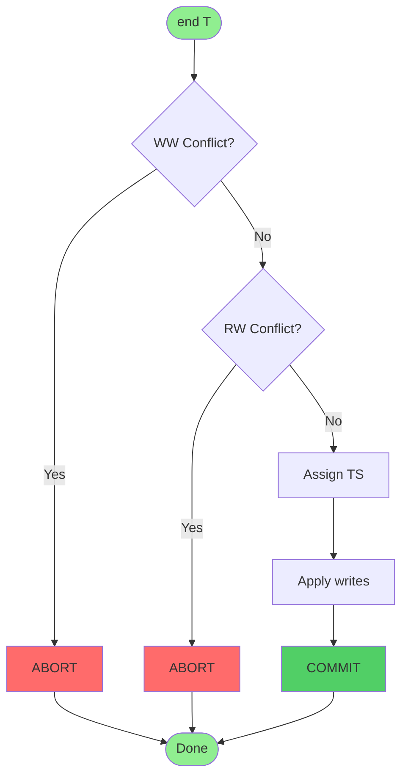
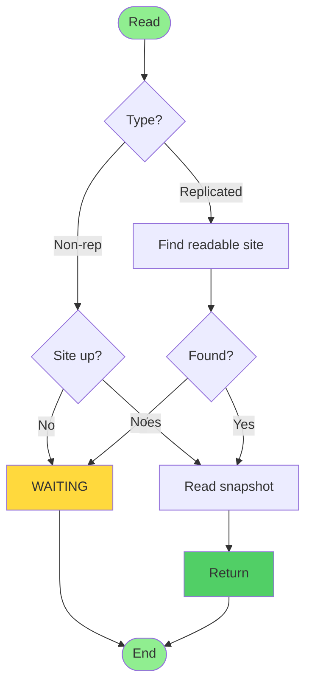
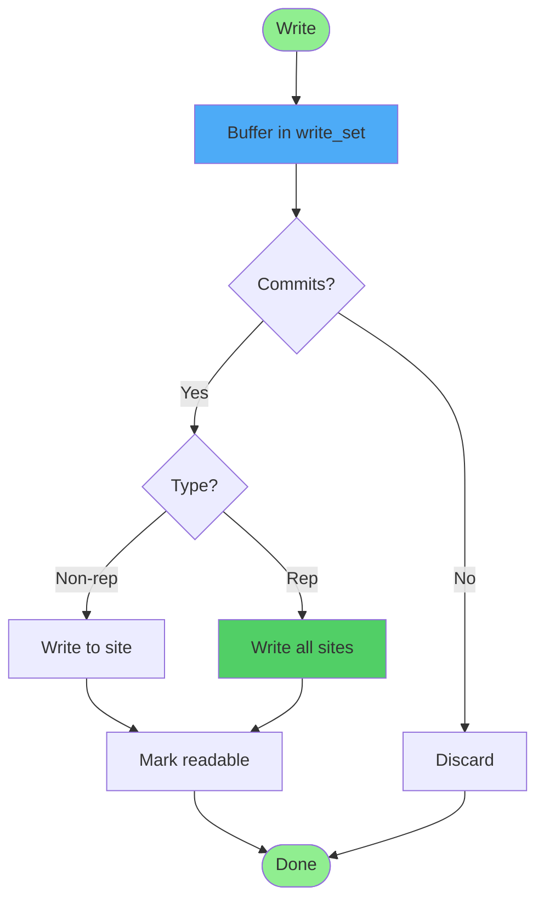
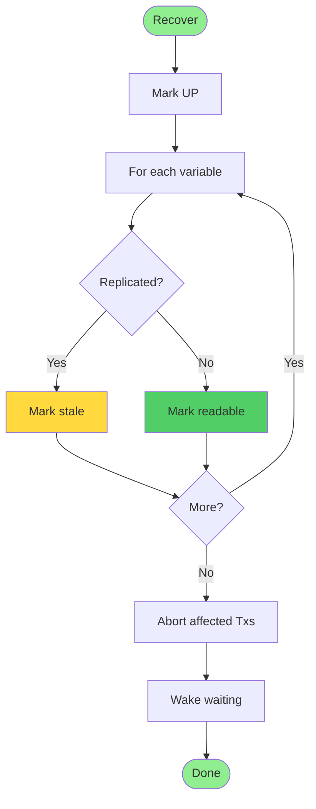

# RepCRec: Replicated Concurrency Control and Recovery System

**Advanced Database Systems Project**

---

## Executive Summary

RepCRec is a distributed replicated database system implementing **Serializable Snapshot Isolation (SSI)** with **Multi-Version Concurrency Control (MVCC)** across 10 distributed sites. The system manages 20 variables with selective replication, demonstrating key distributed database concepts including the **Available Copies algorithm**, optimistic concurrency control, and fault-tolerant recovery.

**Key Features**:
- Serializable consistency guarantees
- MVCC for lock-free reads
- Replicated data with failure tolerance
- Optimistic concurrency control

---

## 1. System Architecture

### 1.1 Components

```mermaid
graph LR
    TM[TransactionManager]
    S1[Site 1]
    S2[Site 2]
    S10[Site 10]
    T[Transactions]
    
    TM -->|Manages| S1
    TM -->|Manages| S2
    TM -->|Manages| "..."
    TM -->|Manages| S10
    T -->|Submit| TM
    
    style TM fill:#ff9999
    style S1 fill:#99ccff
    style S2 fill:#99ccff
    style S10 fill:#99ccff
```

**Core Components**:
1. **TransactionManager (TM)**: Centralized coordinator managing transactions and enforcing consistency
2. **Site**: 10 distributed data sites storing variable replicas
3. **Transaction**: Tracks read/write sets, timestamps, and status
4. **VariableCopy**: MVCC-enabled copies maintaining version histories

### 1.2 Data Distribution

- **Variables**: 20 variables (x1-x20), initial value = 10×i for xi
- **Replication Strategy**:
  - **Odd variables** (x1, x3, ..., x19): Non-replicated, stored at site `1 + (i mod 10)`
  - **Even variables** (x2, x4, ..., x20): Fully replicated across all 10 sites

---

## 2. Core Algorithms

### 2.1 Transaction Lifecycle



### 2.2 Multi-Version Concurrency Control (MVCC)

**Objective**: Enable concurrent reads without blocking writers using version snapshots.



**Key Algorithm**:
```python
def read_snapshot(self, snapshot_timestamp: int) -> int:
    snapshot_value = self.version_history[0][1]  # Initial value
    for commit_ts, value in self.version_history:
        if commit_ts < snapshot_timestamp:
            snapshot_value = value
        else:
            break
    return snapshot_value
```

**Complexity**: O(V) where V = number of versions

### 2.3 Serializable Snapshot Isolation (SSI)

**Objective**: Provide serializability while maintaining snapshot isolation benefits.



**Validation Rules**:

1. **Write-Write Conflict**: If T2 commits after T1 starts and both write to the same variable → T1 aborts
2. **Read-Write Conflict**: If T2 commits after T1 starts and:
   - T2 wrote what T1 read, OR
   - T2 read what T1 wrote
   → T1 aborts

**Complexity**: O(T·N) where T = committed transactions, N = variables

### 2.4 Available Copies Algorithm (ROWAA)

**Strategy**: "Read One, Write All Available"

#### Read Operation Flow



#### Write Operation Flow



### 2.5 Failure Recovery (Stale Flag Protocol)



**Recovery Logic**:
- **Non-replicated variables**: Immediately readable (only copy exists)
- **Replicated variables**: Marked stale until next committed write updates them

---

## 3. System Features

### 3.1 Transaction Types

| Type | Command | Validation | Commit |
|------|---------|------------|--------|
| **Read-Write** | `begin(T1)` | SSI validation | After validation |
| **Read-Only** | `beginRO(T1)` | None | Immediate |

### 3.2 Supported Operations

**Transaction Commands**:
- `begin(Ti)` - Start read-write transaction
- `beginRO(Ti)` - Start read-only transaction
- `R(Ti, xj)` - Read variable xj
- `W(Ti, xj, v)` - Write value v to xj
- `end(Ti)` - Commit or abort transaction

**Site Commands**:
- `fail(i)` - Site i fails
- `recover(i)` - Site i recovers

**Query Commands**:
- `dump()` - Show all variables at all sites
- `dump(i)` - Show all variables at site i
- `dump(xj)` - Show variable xj at all sites

---

## 4. Implementation

### 4.1 Code Structure

```
RepCRec/
├── main.py                      # Entry point
├── transaction_manager.py       # Core controller (430 lines)
├── transaction.py               # Transaction state (81 lines)
├── data_site.py                 # Site management (113 lines)
├── variable_copy.py             # MVCC support (75 lines)
└── parser.py                    # Command parser (156 lines)
```

**Total**: ~900 lines of Python code

### 4.2 Key Data Structures

```python
# TransactionManager
sites: List[Site]                    # 10 sites
transactions: Dict[str, Transaction]  # Active transactions
committed_transactions: List[Transaction]  # For validation
current_timestamp: int                # Global logical clock

# Transaction
start_timestamp: int
read_set: Set[str]                   # Variables read
write_set: Dict[str, int]            # Private workspace
status: TransactionStatus

# VariableCopy
value: int                           # Current value
version_history: List[Tuple[int, int]]  # (timestamp, value)
is_readable: bool                    # Stale flag
```

### 4.3 Complexity Analysis

| Operation | Time Complexity | Space Complexity |
|-----------|----------------|------------------|
| Read | O(V) | O(1) |
| Write | O(1) deferred | O(1) |
| Commit validation | O(T·N) | O(1) |
| Site failure | O(T·V) | O(1) |

Where: V = versions, T = transactions, N = variables

---

## 5. Usage

### 5.1 Requirements

- **Python**: 3.7+
- **Dependencies**: None (standard library only)
- **Platform**: Cross-platform

### 5.2 Running the System

**From file**:
```bash
python main.py test_basic.txt
```

**Interactive mode**:
```bash
python main.py
> begin(T1)
> W(T1, x1, 100)
> end(T1)
> dump()
```

**Batch testing**:
```bash
./run_all_tests.sh
```

### 5.3 Test Suite

| Test Case | Description | Coverage |
|-----------|-------------|----------|
| `test_basic.txt` | Basic read-write operations | Core functionality |
| `test_ww_conflict.txt` | Write-write conflicts | First Committer Wins |
| `test_rw_conflict.txt` | Read-write conflicts | SSI validation |
| `test_site_failure.txt` | Site failures and recovery | Fault tolerance |
| `test_replicated.txt` | Replicated variable handling | Available Copies |
| `test_snapshot.txt` | MVCC snapshot isolation | Version management |
| `test_readonly.txt` | Read-only transactions | Snapshot reads |
| `test_comprehensive.txt` | Complex mixed scenarios | Integration |

**Validation Results**: All 8 test cases pass ✅

---

## 6. Theoretical Foundations

### 6.1 Consistency Guarantees

- **Serializability**: Execution equivalent to some serial order
- **Atomicity**: Transactions commit or abort entirely
- **Consistency**: Invariants maintained across commits
- **Isolation**: Transactions see consistent snapshots
- **Durability**: Committed data persists

### 6.2 Key References

1. **Serializable Snapshot Isolation**: Fekete et al. (ACM TODS 2005)
2. **Available Copies Algorithm**: Bernstein et al. (1987)
3. **Multi-Version Concurrency Control**: Reed (MIT PhD Thesis 1978)
4. **Distributed Database Systems**: Özsu and Valduriez (2020)

---

## 7. Project Statistics

- **Lines of Code**: ~900 (with documentation)
- **Core Algorithms**: 3 (MVCC, SSI, Available Copies)
- **Test Coverage**: 8 comprehensive scenarios
- **External Dependencies**: 0

**Key Contributions**:
1. Clear demonstration of SSI conflict detection
2. Practical MVCC implementation
3. Effective fault-tolerant replication protocol
4. Comprehensive test suite
5. Extensive documentation

---

## Appendix: Command Reference

### Transaction Commands
| Command | Description | Example |
|---------|-------------|---------|
| `begin(Ti)` | Start read-write transaction | `begin(T1)` |
| `beginRO(Ti)` | Start read-only transaction | `beginRO(T2)` |
| `R(Ti, xj)` | Read variable | `R(T1, x5)` |
| `W(Ti, xj, v)` | Write value to variable | `W(T1, x5, 100)` |
| `end(Ti)` | Commit/abort transaction | `end(T1)` |

### Site Commands
| Command | Description | Example |
|---------|-------------|---------|
| `fail(i)` | Site i fails | `fail(3)` |
| `recover(i)` | Site i recovers | `recover(3)` |

### Query Commands
| Command | Description | Example |
|---------|-------------|---------|
| `dump()` | Show all data | `dump()` |
| `dump(i)` | Show site i data | `dump(5)` |
| `dump(xj)` | Show variable xj | `dump(x7)` |

---

**Document Version**: 1.0  
**Date**: November 5, 2025  
**Course**: Advanced Database Systems  
**Project**: RepCRec - Distributed Concurrency Control
