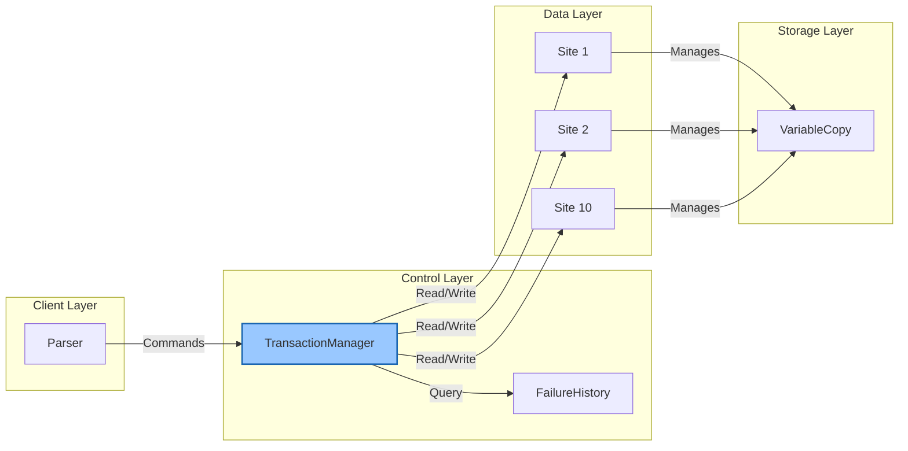
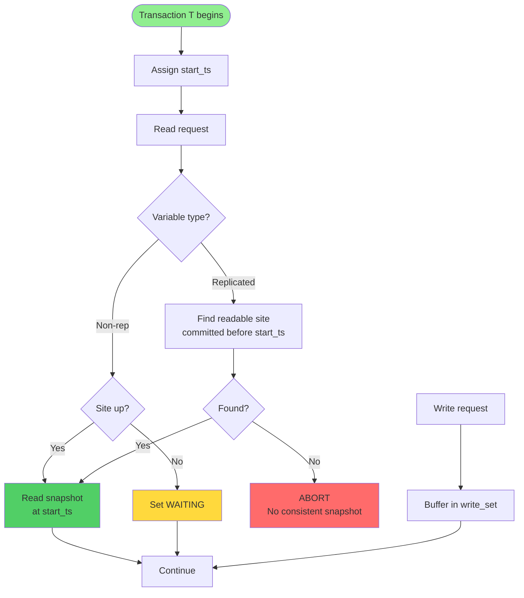
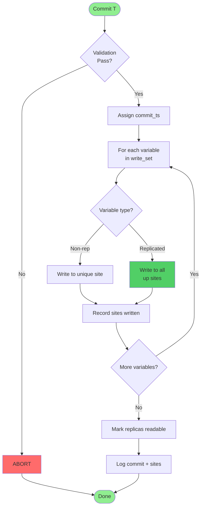
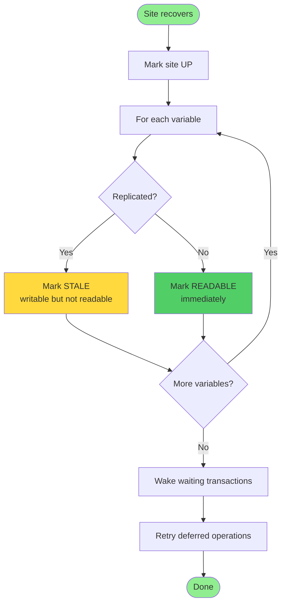

# RepCRec Distributed Concurrency Control Proposal

**Advanced Database Systems — Fall 2025**

**Team:** Xi Wang and Sihang Zhao

## Purpose and Scope

This proposal describes the design of a simulator for **RepCRec**—a tiny distributed database used in the Advanced Database Systems course. The simulator must implement **serializable snapshot isolation (SSI)** with replication and failure recovery. 

### System Specifications

- **Variables**: 20 variables (x1 … x20), each initialized to `10 × index`
- **Sites**: 10 distributed sites
- **Data Distribution**:
  - **Odd-indexed variables** (x1, x3, …, x19): Non-replicated, stored at site `1 + (index mod 10)`
  - **Even-indexed variables** (x2, x4, …, x20): Fully replicated across all 10 sites
- **MVCC**: Each site maintains its own multi-version concurrency control history, which is erased when that site fails
- **Interface**: Processes commands from a script or standard input, executes read/write requests, handles site failures and recoveries, and produces deterministic log output

## High-Level Architecture

The system comprises four logical layers: a client interface that parses commands, a control layer with a central transaction manager and failure history, a set of ten site processes holding data copies, and a storage layer implementing MVCC for each variable.

### Execution Overview

The **Parser** reads instructions from a script or standard input and forwards normalized requests to the **Transaction Manager**. The Transaction Manager maintains global state (active transactions, logical clock, site status and failure history) and orchestrates reads, writes, commits, aborts, fails and recoveries. For data access it communicates with individual **Site** modules, each of which holds a collection of **VariableCopy** objects implementing MVCC. A separate **FailureHistory** record tracks when each site failed or recovered and is consulted during commit to determine if a transaction wrote to a site that later failed.

---

## Module Responsibilities

### Parser

The parser performs only lexical and syntactic normalization; semantics and time advancement are handled by the Transaction Manager.

| Function | Purpose | Input | Output | Side Effects |
|----------|---------|-------|--------|--------------|
| `parse_line(line)` | Normalize a single command line | Raw string | `(command, args)` or `None` | None |
| `parse_file(path)` | Read a script into an ordered command list | Path to script file | List of normalized commands | Prints I/O errors |
| `parse_stdin()` | Interactive ingestion from standard input | stdin | List of normalized commands | Prompts user, handles EOF |

### Transaction Manager (TM)

The TM is the centralized coordinator that enforces SSI, manages available-copies replication, tracks site failures, and drives transaction state transitions.

#### Key Responsibilities

1. **Clock Management**: Maintain a logical timestamp that increments on each new line of input. Each transaction obtains its start timestamp when it begins.

2. **Transaction Lifecycle**: 
   - Create and record new transaction objects (`begin` and `beginRO`)
   - Handle read/write requests
   - Perform commit/abort processing (`end`)
   - Maintain per-transaction structures: start timestamp, read set, write set, and wait state

3. **Read Processing**: Implement the instructor's read rules:
   - **Non-replicated variables**: Read from the single site if up; otherwise record the transaction as waiting
   - **Replicated variables**: Choose a site that committed the latest version before the transaction's start and has been up since then. If no such site exists, abort.

4. **Write Processing**: 
   - Stage writes in each transaction's private workspace
   - Writes do not propagate immediately
   - Record which sites were accessed for each variable to detect later site failures

5. **Commit-time Validation**: At `end(T)` perform three checks:

   - **First committer wins**: If any variable in T's write set was committed by another transaction after T began, abort
   - **Dangerous structure detection**: Maintain for each committed transaction the set of transactions that have a read-write (RW) edge to it. If T has a RW edge from some transaction Tk and Tk already has a RW edge from another transaction, abort
   - **Site failure check**: For every site that T wrote to, check the failure history; if the site failed after the write and before commit, abort

   If all checks pass, assign a commit timestamp, propagate staged writes to every currently up site holding the variable, update each affected VariableCopy with the new version, and mark the replicas as readable.

6. **Failure and Recovery**:
   - On `fail(s)`: Mark site s as down and erase its MVCC history
   - On `recover(s)`: Mark site s as up, initialize non-replicated variables as readable, and mark replicated variables as writable but stale

7. **Dump and Diagnostics**: On `dump()`, print the committed values of all copies of all variables, one line per site, sorted by variable ID.

### Transaction Object

Each transaction encapsulates its own state:

**Attributes**:
- `tx_id`: Transaction identifier
- `start_ts`: Start timestamp
- `read_set`: Set of variables read
- `write_set`: Staged writes (private workspace)
- `site_write_times`: First time each site was written
- `waiting_operation`: Deferred operation causing wait state
- `state`: active, waiting, committed, aborted

**Methods**:
- `read(var)`: Add var to read_set and return the snapshot value
- `write(var, value)`: Stage value in the private workspace
- `set_waiting(op) / set_active()`: Manage wait state
- `commit(commit_ts)`: Finalize write set and mark as committed
- `abort()`: Discard staged writes and mark as aborted

### Site

A site represents a data manager for a physical node. It maintains:

**Status**: UP or DOWN. The TM is notified immediately when a fail/recover occurs.

**Variable copies**: A dictionary from variable index to a VariableCopy object. On initialization, variables are assigned according to the data placement rules.

**Methods**:
- `initialize_variables()`: Create the appropriate VariableCopy objects with initial value `10 × index`
- `fail()`: Mark the site down and reset each VariableCopy's MVCC history
- `recover()`: Mark the site up; for each non-replicated variable make the latest version readable immediately; for replicated variables mark them stale until a new commit writes to them
- `write_variable(var, ts, value)`: Append a new version to the MVCC history and mark it readable
- `read_snapshot(var, snapshot_ts)`: Return the latest committed value at or before snapshot_ts if the variable is readable
- `set_stale(var) / set_readable(var)`: Toggle the readable flag for replicated variables
- `dump()`: Format the site's committed snapshot for logging

### VariableCopy

VariableCopy encapsulates MVCC for a single variable on a given site. It stores a list of versions `(commit_ts, value, readable)` ordered by commit time.

**Operations**:
- `write(ts, value)`: Record new version
- `read_snapshot(snapshot_ts)`: Return the latest committed value at or before snapshot_ts
- `reset_snapshot_history()`: Clear history on failure
- `set_stale() / set_readable()`: Control stale flags on recovery

### FailureHistory

For each site, the simulator records a sequence of fail and recover events. This history is used during commit to determine whether a site failed after a transaction wrote to it. Maintaining explicit failure timestamps is cheaper than reconstructing them from Site states alone and clarifies the "available copies" abort rule.

---

## Concurrency Control Plan

The simulator's concurrency control algorithm is adapted directly from the instructor's notes and the concurrency literature:

### Snapshot Reads and Staged Writes

- Each transaction T obtains a start timestamp
- Reads return the most recent version of a variable committed before T began, subject to the read rules
- Writes are buffered in T's private workspace and do not become visible until commit

### Commit-time Validation

When `end(T)` is encountered, the TM checks for:

1. **First committer wins**: A later committed write to any variable in T's write set
2. **Dangerous structure**: Two consecutive RW edges in the serialization graph
3. **Site failure**: A site failure after T's write to that site

If any of these conditions hold, T aborts; otherwise it commits.

### Available-Copies Writes (ROWAA)

On commit, the TM sends each staged write to every site that is both up and contains a copy of the variable. Sites that are down do not receive the write and will remain stale until recovery.

### Waiting and Aborting

- A transaction waits if it needs to read a non-replicated variable whose site is down or if there is no readable copy of a replicated variable
- It remains in the wait state until recovery (at which point the TM replays the deferred operation)
- A transaction aborts if it violates any validation rules or if all replicas of a needed variable were down at its start

### Failure Recovery

- When a site recovers, non-replicated variables become readable immediately
- Replicated variables remain stale until a commit writes them again
- Transactions that begin after a site recovers cannot read a replicated variable from that site until a new commit updates it

## Planned Verification

To ensure correctness, the team will develop a suite of test scripts that exercise different aspects of the implementation.

### Baseline Test Scenarios

1. **Basic operations**: begin, read, write, and end cycle with no failures
2. **Replication**: Correct handling of odd and even indices across sites and proper available-copies writes
3. **Snapshot isolation**: Reads observe the snapshot value at the transaction's start time; new writes become visible only after commit
4. **Site failure and recovery**: 
   - Transactions wait appropriately when a site holding a non-replicated variable is down
   - Fail/recover events erase and restore MVCC histories
   - Replicated variables remain stale until a new commit writes them
5. **Concurrency conflicts**: 
   - First-committer violations
   - Dangerous structure cycles
   - Confirm the implementation aborts the correct transactions
6. **Comprehensive scenarios**: Mixed sequences of read/write/commit/fail/recover/dump commands

### Corner Cases

Additional tests will cover:
- Reading a replicated variable after all sites fail between the last commit and the transaction start
- Aborting on writes followed by site failure
- Re-executing deferred operations after recovery

---

